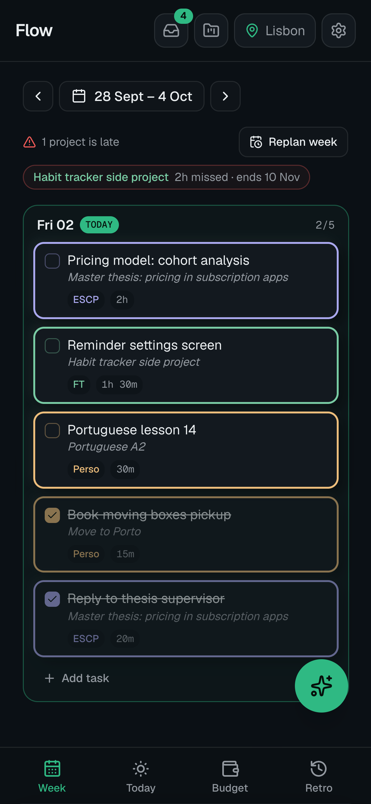
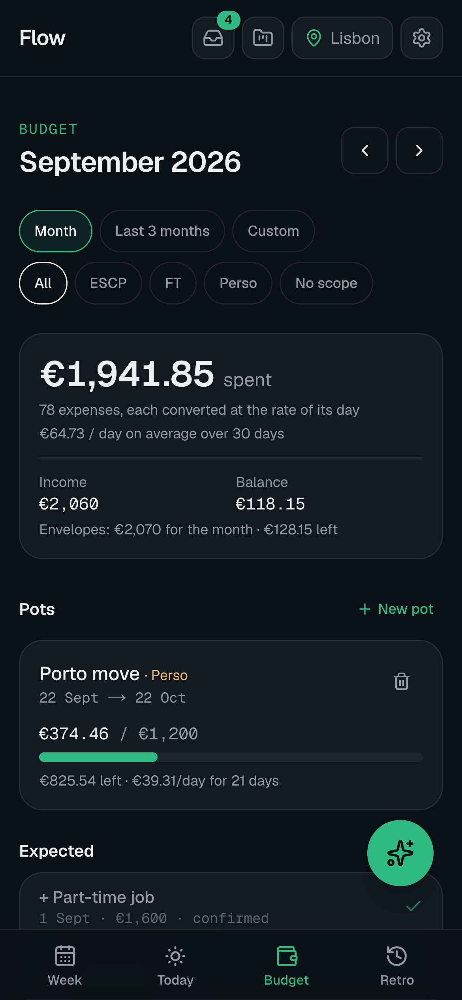
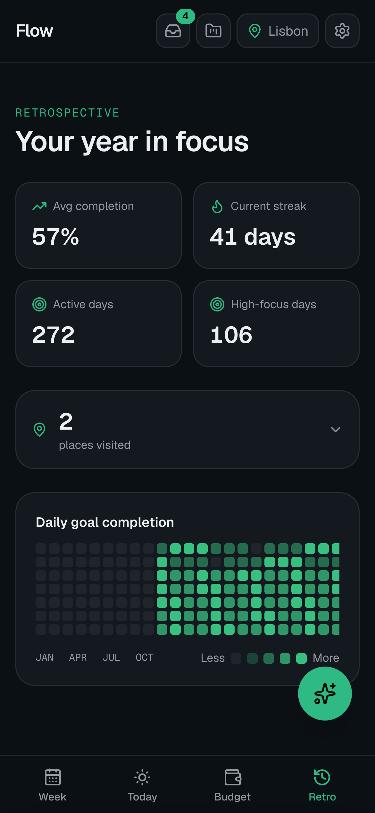
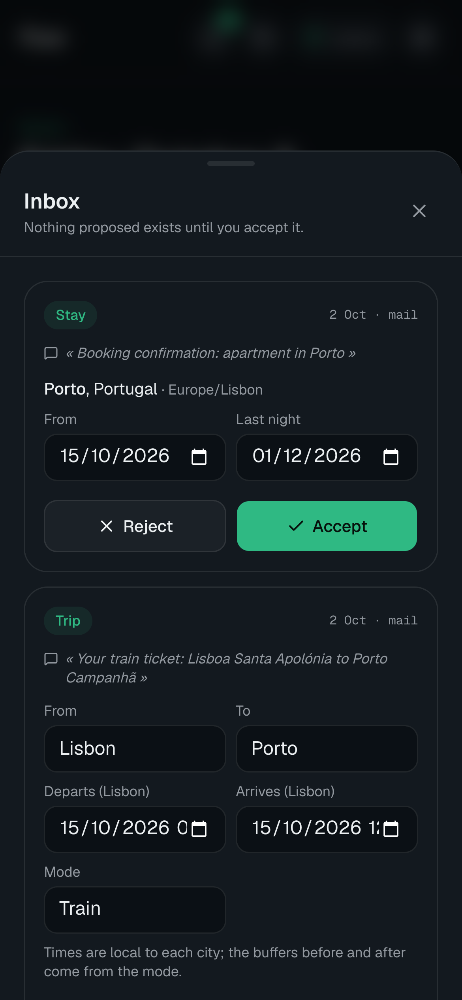
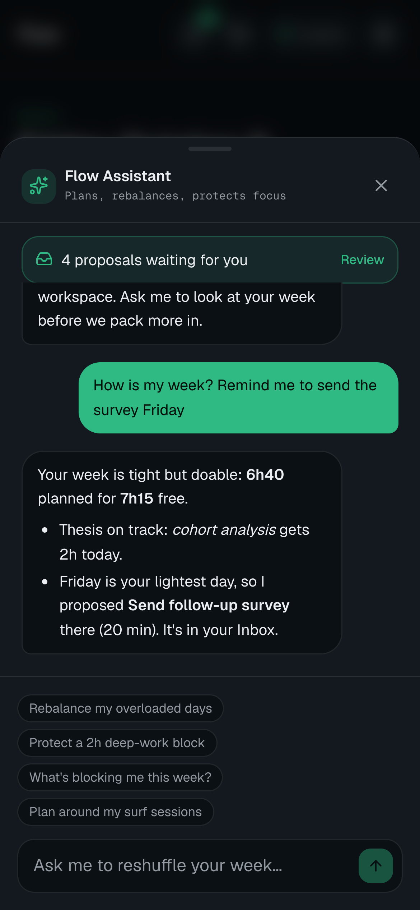
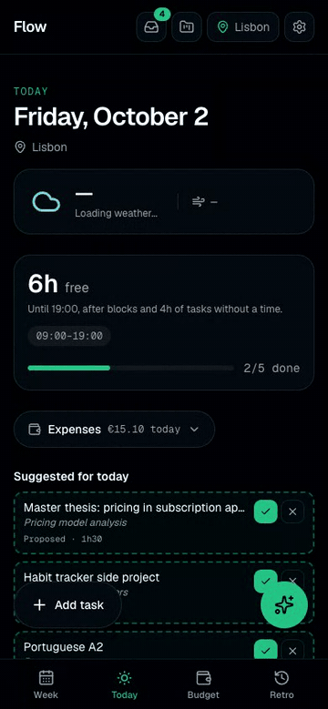
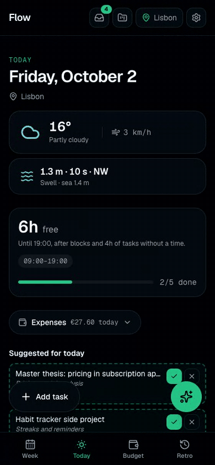
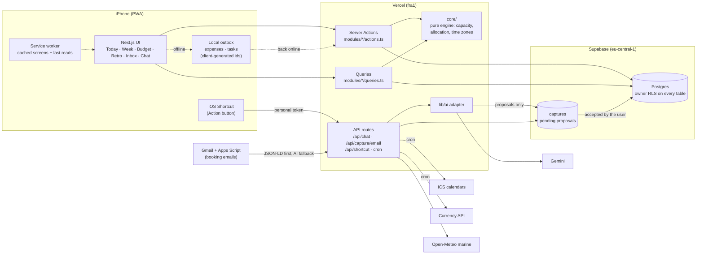

# Flow

> **Source code is private. This repo showcases the product, architecture and key decisions.**
> All screenshots use fictional demo data.

**Flow makes long-term work visible and doable day by day, based on real capacity, and gives a clear view of the monthly budget.**
Long-term work is invisible in day-to-day tools; Flow turns each project into a stock of minutes and spreads it over the free time that actually exists between classes, trips and routines.
It is a mobile-first PWA built for one demanding user (me: a master's student running side projects in parallel and traveling continuously), where the AI can propose anything but writes nothing without validation.

📄 [Slides (PDF)](flow-slides.pdf) · 🏗 [Architecture](#architecture) · 🧭 [Key decisions](#key-decisions) · 🛠 [Method](#method)

---

## Features

<table>
<tr>
<td width="33%" valign="top"> <b>Today</b> What to do now, sized to the free time left today. Quick expense entry in two taps, with currency and stay inferred.</td>
<td width="33%" valign="top"> <b>Week</b> A capacity-aware plan: each day's window minus calendar blocks, trips and routines. Projects are spread toward their deadline; what doesn't fit becomes visible debt with a slip date.</td>
<td width="33%" valign="top"> <b>Budget</b> Monthly envelopes, incomes, recurring charges and pots. Multi-currency expenses frozen at the day's EUR rate, with an end-of-month projection.</td>
</tr>
<tr>
<td valign="top"> <b>Retro</b> Planned vs. actual time, done vs. blocked, and notes left when closing tasks.</td>
<td valign="top"> <b>Inbox</b> Every proposal from the assistant, booking emails or shortcuts lands here. Edit, accept or reject: nothing is written without validation.</td>
<td valign="top"> <b>AI assistant</b> Knows your week, projects and deadlines. It answers and <i>proposes</i> tasks or projects; proposals go to the Inbox.</td>
</tr>
</table>

### Flows

| Add an expense (two gestures) | Validate a booking email in the Inbox |
|---|---|
|  |  |

Also in the product: stays and trips that drive the timezone, weather and blocked travel time · recurring tasks without duplicates · ICS calendar sync · surf conditions for the current stay · an iOS Shortcut (Action button) that logs an expense in under 5 seconds without opening the app · offline mode with a local queue.

---

## Architecture

**Invariants enforced across the codebase**
- No database call in components: reads live in `modules/*/queries.ts`, writes are Server Actions in `modules/*/actions.ts`.
- Secrets, AI and every external call run server-side only.
- Every table has `user_id` + owner-only Row Level Security; every schema change is a migration (a script checks RLS coverage).
- All dates and time zones go through a single `core/time` module (the user lives across time zones).
- The AI proposes, the user validates: no direct write from the AI or from a capture.
- Mobile first: every view works one-handed on an iPhone.

---

## Key decisions

31 decisions are documented in the private repo (3 lines max each: decision + why). The most structuring ones:

### 1. The AI proposes, the user validates
- **Problem:** an assistant that creates tasks and expenses directly ends up polluting the plan and the budget, and every error has to be found and undone.
- **Choice:** the assistant's tools (`propose_task`, `propose_project`…) only drop a *capture* into an Inbox. The user edits, accepts (the record is created) or rejects. Acceptance is atomic (`pending → accepted` conditional update, rolled back if creation fails). Booking emails and shortcuts feed the same queue.
- **Trade-off:** one extra tap per AI action, in exchange for zero uncontrolled writes and a single review surface for every source.

### 2. Capacity-based allocation instead of to-do lists
- **Problem:** long-term projects (a thesis, a side project) don't show up in a to-do list until it's too late.
- **Choice:** a project is a stock of minutes split into milestones. A pure engine in `core/` computes each day's real capacity (window − calendar blocks − trip buffers − planned tasks), serves the nearest deadline first and spreads each project evenly until it, in 30-min chunks or full sessions. What doesn't fit becomes **debt with a slip date**.
- **Trade-off:** requires estimating projects in hours; in return, the long term starts now and every delay has a date. The same engine logic is reused for money envelopes.

### 3. Booking emails without an agent
- **Problem:** flights, trains and lodging should land in the plan and the budget without typing them, on a free AI quota.
- **Choice:** a dedicated Gmail + Apps Script posts mails to a token-protected webhook. The code reads schema.org JSON-LD first and makes **one** AI extraction call only if the mail looks like a booking. Business rules (time zones, a stay ending the night before check-out, price → expense) live in code. Idempotent by mail id.
- **Trade-off:** less "magic" than an autonomous agent, but deterministic, cheap, testable, and every result still goes through the Inbox.

### 4. Multi-currency money frozen at the day's rate
- **Problem:** traveling across countries means expenses in GBP, USD, LKR, VND…; summing currencies or reconverting at today's rate makes past months drift.
- **Choice:** amounts stored as integer minor units, never summed across currencies. Each expense stores its day's FX rate and EUR value, computed server-side (free keyless API with a mirror fallback; converted later if offline). An expense keeps two axes: its date (which month's budget) and its stay (which country it pays for).
- **Trade-off:** a bit more storage and logic per row, for stable history and a correct "per country" view.

### 5. Offline-first where it matters, online elsewhere
- **Problem:** the app is used on the move (planes, trains, weak networks), but full offline sync is expensive to build and maintain.
- **Choice:** a hand-written service worker (no dependency) caches screens; every query keeps its last result on the phone; only **three** writes go through a local queue (expense, new task, check a task), each with a client-generated id so a resend never duplicates. Everything else clearly asks for the network.
- **Trade-off:** last-write-wins on conflicts and a limited offline surface, for a small, predictable implementation.

### 6. One app, one user, real environments
- **Problem:** a solo product still needs safe iteration on real daily data.
- **Choice:** a single Next.js app split into modules (not a monorepo); one branch per iteration with a Vercel preview tested on iPhone; separate dev and prod databases once daily use started; production merges only by the product owner.
- **Trade-off:** more process than a weekend project usually has, which is what makes it possible to ship daily without breaking the app used every day.

---

## Method

Flow is built with **AI coding agents (Claude Code) doing the implementation, while I act as Product Owner**: I write the vision, cut the roadmap into iterations, define acceptance criteria, test every build on my phone, and decide what goes to production.

- **22 iterations** (sprints), each with explicit acceptance criteria, validated by me on a live preview before merge.
- **31 documented decisions** (`DECISIONS.md`): decision + reason in 3 lines, never revisited without a new entry.
- **Guardrails written for the agent** (`CLAUDE.md`): architecture invariants, forbidden actions (no secrets, no commits to `main`, no migration without approval, no out-of-scope refactor), and a "limits" log instead of silent scope creep.
- **Repeatable rituals as commands**: `/recap` at session start, `/ship` (typecheck, lint, tests, push, delivery report with the preview link sent to Discord), `/handoff` at session end, `/goprod` for production (migrations + merge) only when I trigger it.
- **Definition of Done** for every iteration: typecheck, lint and tests pass, RLS checked, works one-handed on iPhone, delivery report with known limits.

## In numbers

| | |
|---|---|
| Duration | 3 weeks (Sep 12 → Oct 2, 2026) |
| Commits | 126 |
| Pull requests | 25 |
| Iterations | 22 |
| Documented decisions | 31 |
| Database migrations | 20 |

**Stack:** Next.js 16 (App Router, Server Actions) · TypeScript strict · Supabase (Postgres + RLS + Auth) · Tailwind / shadcn · Gemini behind an adapter · Vercel · Vitest.

## What's next
- **Unified retro:** a weekly score based on long-term progress, with time and money debt in one view.
- **Journaling**, then an **anticipation agent** that flags conflicts (a deadline vs. a trip) before they happen, still as proposals.
- Project history, reminders, and travel detection from the calendar.
